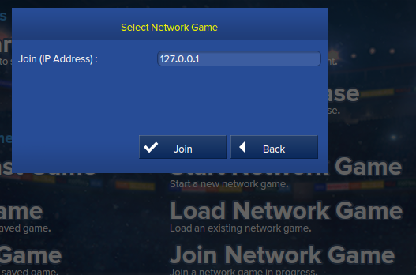

# EHMLauncher
Simple utility to input the IP in EHM.

**[Download here](https://github.com/Gabisonfire/EHMLauncher/releases/latest)**

# How-to
- Just launch the application and enter you servers ips with a description.
- Then minimize the app, it will be minimized to your tray.
- Launch EHM
- Click "Join network game"
- Right-Click the tray icon and choose your league.

 

- Click the EHM window again.

